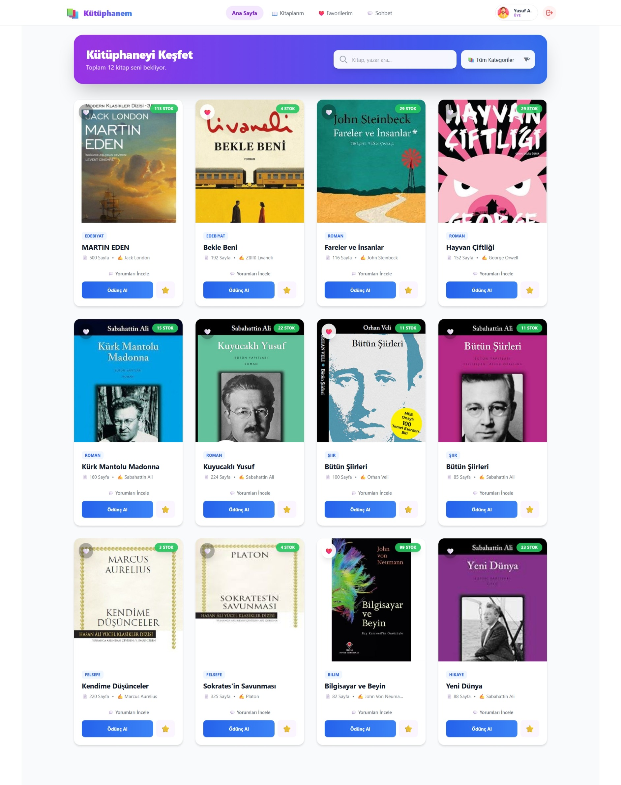
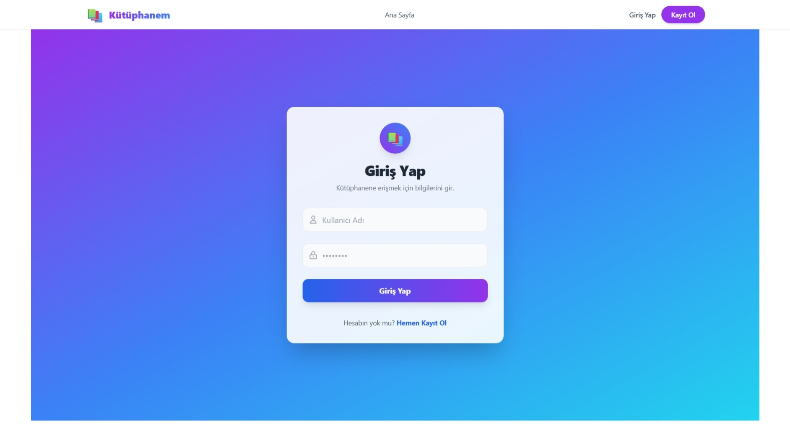
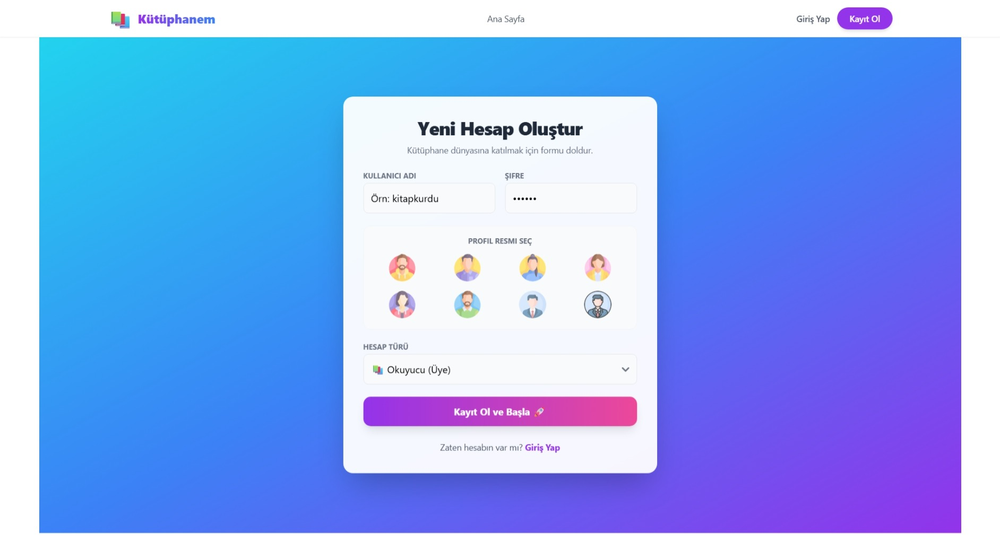
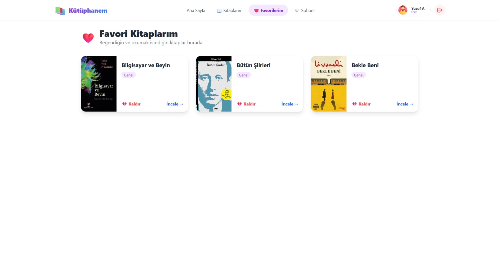
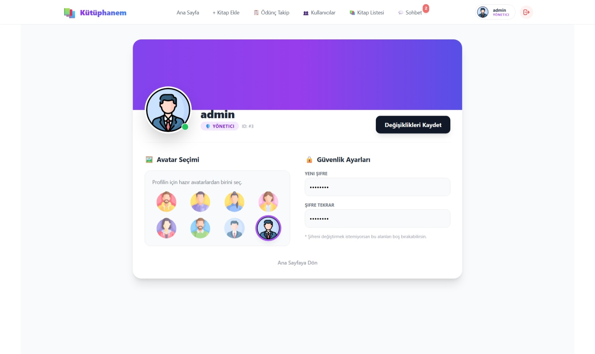
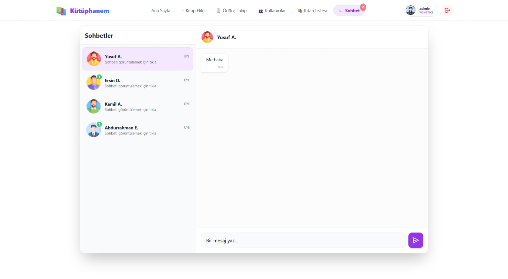
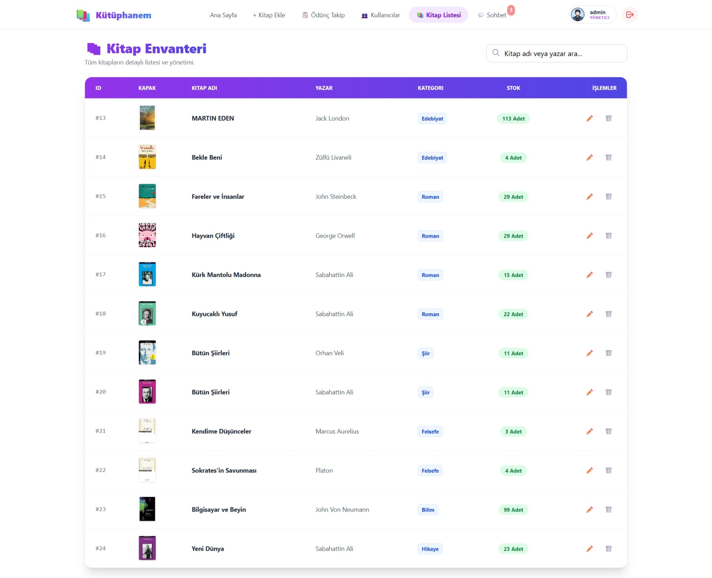
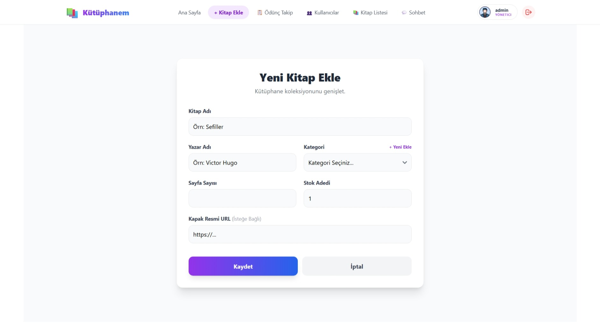
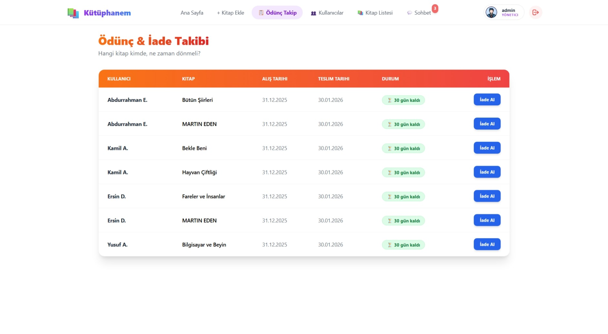
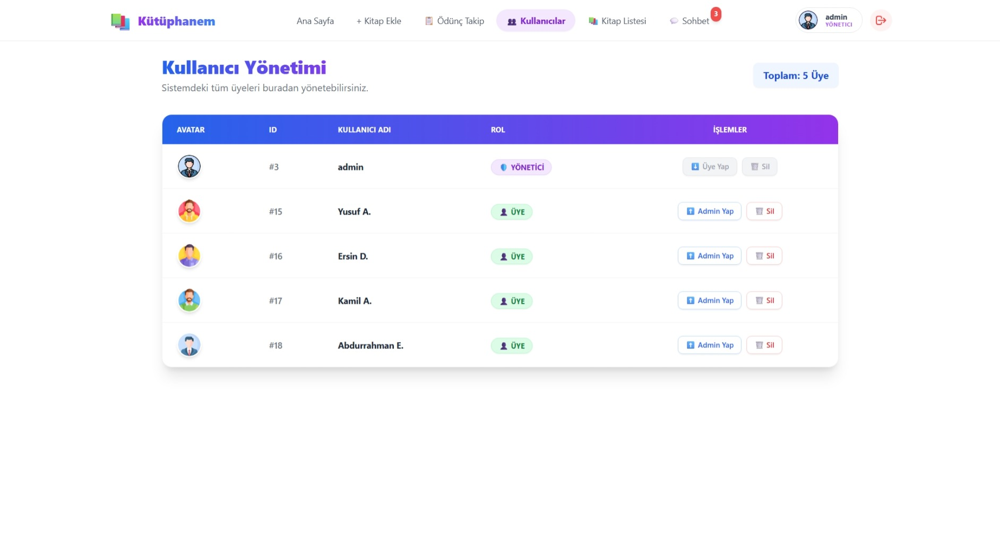

# 📚 Kütüphane Yönetim Sistemi (Library Management System)

Modern, kullanıcı dostu ve tam kapsamlı bir kütüphane yönetim sistemi. Kullanıcıların kitap ödünç alabildiği, yorum yapabildiği, birbirleriyle mesajlaşabildiği ve yöneticilerin tüm envanteri takip edebildiği bir platform.

## ✨ Özellikler

### 👤 Kullanıcı (Üye) Özellikleri
* **Modern Arayüz:** Glassmorphism ve Gradient tasarımlarla zenginleştirilmiş kullanıcı deneyimi.
* **Kitap İşlemleri:** Kitapları listeleme, arama, kategorilere göre filtreleme.
* **Ödünç Alma:** Stok durumuna göre kitap ödünç alma ve iade tarihi takibi.
* **Sosyal Etkileşim:**
    * **💬 Canlı Sohbet:** Diğer üyeler ve yöneticilerle anlık mesajlaşma (Okundu bilgisi ve bildirim rozeti ile).
    * **⭐ Değerlendirme:** Kitaplara puan verme ve yorum yapma.
    * **❤️ Favoriler:** Beğenilen kitapları favorilere ekleme.
* **Profil Yönetimi:** Avatar seçimi, şifre değiştirme ve kişisel bilgiler.

### 🛡️ Yönetici (Admin) Özellikleri
* **Dashboard:** Anlık istatistikler (Toplam kitap, aktif ödünçler, üye sayısı).
* **Envanter Yönetimi:** Excel benzeri tablo yapısıyla hızlı kitap ekleme, silme ve güncelleme.
* **Kullanıcı Yönetimi:** Üyeleri listeleme ve yönetme.
* **Ödünç Takibi:** Geciken kitapları takip etme ve iade alma işlemleri.

---

## 📸 Proje Ekran Görüntüleri

### 🔐 Giriş ve Kayıt İşlemleri
Modern ve güvenli giriş/kayıt ekranları.

| Giriş Ekranı | Kayıt Ekranı |
| :---: | :---: |
|  |  |

---

### 👤 Kullanıcı Arayüzü (Üye Paneli)

**Ana Sayfa & Favoriler**
Kullanıcıların kitapları incelediği ve favorilerine eklediği alanlar.
| Kullanıcı Ana Sayfa | Favorilerim |
| :---: | :---: |
|  |  |

**Profil & Ödünç Takip**
Kişisel ayarlar ve ödünç alınan kitapların durumu.
| Profil Güncelleme | Kitaplarım (Ödünç) |
| :---: | :---: |
|  |  |

---

### 💬 Sosyal Modül
**Canlı Sohbet (Chat)**
Kullanıcılar ve yöneticiler arası anlık mesajlaşma sistemi.

---

### 📊 Yönetici Paneli (Admin Dashboard)

**Genel Bakış**
Yöneticiler için özet istatistikler ve hızlı erişim kartları.

**Kitap Yönetimi**
Kitap ekleme ve detaylı envanter listesi.
| Kitap Listesi (Envanter) | Yeni Kitap Ekleme |
| :---: | :---: |
|  |  |

**Kullanıcı ve Ödünç Takibi**
Üyelerin ve ödünç verilen kitapların yönetimi.
| Ödünç Takip | Kullanıcı Yönetimi |
| :---: | :---: |
|  |  |

---

## 🛠️ Teknolojiler

Bu proje aşağıdaki modern teknolojiler kullanılarak geliştirilmiştir:

**Frontend (İstemci):**
* ⚛️ **React + Vite:** Hızlı ve performanslı UI geliştirme.
* 🎨 **TailwindCSS:** Modern ve responsive stillendirme.
* 🔔 **Sonner:** Şık bildirim (toast) mesajları.
* 📡 **Axios:** API istekleri yönetimi.

**Backend (Sunucu):**
* 🦁 **NestJS:** Modüler ve ölçeklenebilir backend mimarisi.
* 🗄️ **TypeORM:** Veritabanı ilişkileri ve yönetimi.
* 💾 **SQLite:** Hafif ve hızlı veritabanı çözümü.
* 🔐 **JWT & Bcrypt:** Güvenli kimlik doğrulama ve şifreleme.

---

